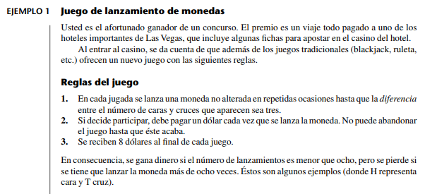
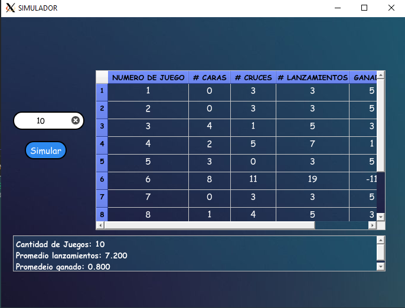
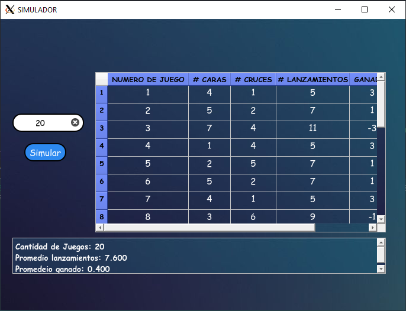
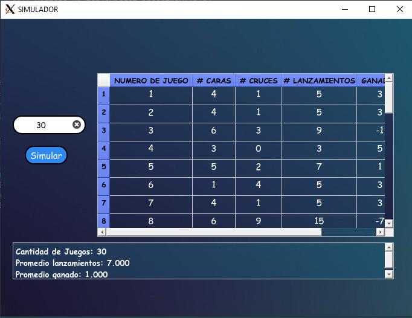

# 
 Universidad Distrital Francisco Jose de Caldas 

## Investigación de Operaciones 3
## Ejercicio de Simulacion 

## Integrantes :

* ### Luis Guillermo Vélez Segura   Cod: 20181020113
* ### Juan Diego Hernández Amaya    Cod: 20181020097
* ### Vivián Peña Hurtado           Cod: 20181020104    
* ### Johan Andrés Aguirre Díaz     Cod: 20181020072

## Ejercicio:

Para este ejecicio se uso el lenguaje  python  para realizar la simulacion del juego para ello, se genero la siguinte linea de codigo que se ve acontinuacion:

~~~
for i in range(ingresado):
            lista=[]
            diferencia=0
            while diferencia !=3:
                cara_moneda = random.randint(0,99)
                if cara_moneda <50:
                    lista.append('Ca')
                elif cara_moneda >=50:
                    lista.append('Cr')
                if abs(lista.count('Ca')-lista.count('Cr'))==3:
                    diferencia= abs(lista.count('Ca')-lista.count('Cr'))        
            else:
               self.matriz.append([i+1,lista.count('Ca'),lista.count('Cr'),len(lista),8-len(lista)])   
~~~
Con el anterior ciclo se generan todos los lanzamientos necesarios para lograr que la diferencia entre caras y cruces sea igual a 3; además se generarn todas las jugadas que ingrese el usuario como se ve a continuacion:

*  Caso 10 juegos 
    
 

* Caso 20 juegos
    
 

* Casao 30 juegos
    
 

Como podemos ver en las anteriores imagenes se esta simulando cuando hay 10 juegos consecutivos , 20  y 30 dandonos a sives el numero de promedio de lanzamientos y el de ganacioas para algunos la ganancia es positiva para otros es negativa pero  se puede concluir que ya sea  ganacia o perdida el valor es  pequeño  entonces no es muy favorable jugar el juego si se busca mayor ganacia que perdida 

Link del repositorio del codigo https://github.com/JohanAndres19/Simulacion

## Bibliografía

Frederick S., H., & Geral J., L. (2010). Introducción a la Investigacion de Operaciones. Mexico D.F: McGRAW-HILL.

